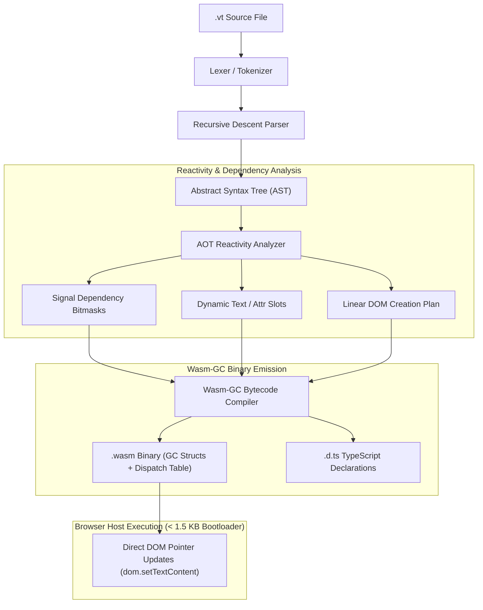

<div align="center" class="intro-header">

# Volt

**A compiled, reactive web language targeting WebAssembly Garbage Collection (Wasm-GC) with zero Virtual DOM, sub-millisecond mounting, and micro-footprint binaries.**

[](https://voltdemo.vercel.app/) [](https://github.com/bshea-1/volt/releases) [](#getting-started) [](https://opensource.org/licenses/MIT)

</div>

<div align="center" class="quick-nav">

[Live Demo](https://voltdemo.vercel.app/) | [About](#about) | [Why Volt?](#why-volt) | [Overview](#overview) | [Architecture](#architecture) | [Language Specification](#language-specification) | [Getting Started](#getting-started) | [Comparison](#comparison) | [CLI Reference](#cli-reference) | [FAQ](#faq) | [License](#license)

</div><br>

<div class="mob-tip">

> [!TIP]
> Experience the performance difference live: [**voltdemo.vercel.app**](https://voltdemo.vercel.app/) runs a high-scale 3D force-directed graph simulation compiled with Volt.

</div>

---

## About

**Volt** is a purpose-built, statically typed programming language designed from the ground up for the next generation of high-performance web applications.

Historically, web developers have faced a fundamental compromise:
1. **JavaScript UI Frameworks (React, Vue, Angular)** offer declarative syntax and great developer ergonomics, but pay a heavy price: tens of kilobytes of runtime bundle overhead, expensive Virtual DOM allocations and reconciliation passes, and noticeable hydration delays on resource-constrained devices.
2. **Traditional WebAssembly (Rust, C++, Go)** provides raw execution speed, but compiling to linear WebAssembly memory requires shipping an entire custom memory allocator or garbage collector in the binary (resulting in 50 KB – 2 MB+ binaries for simple components) plus complex serialization overhead across the JavaScript/Wasm bridge.

### Volt's Core Purpose

Volt eliminates this tradeoff by targeting standard **WebAssembly Garbage Collection (Wasm-GC)**. By leveraging the host browser's native garbage collector and compiling declarative UI definitions directly into deterministic, bitmask-driven reactive dispatch tables, Volt delivers:

* **Bare-Metal Compilation Speed**: Your reactive logic and DOM interaction compile directly into native Wasm-GC bytecode.
* **Microscopic Binary Size**: Standard interactive components compile to **~1.1 KB** uncompressed, completely eliminating runtime bloat.
* **Zero Virtual DOM & Zero Hydration**: Signals compile directly to targeted host DOM updates (`dom.setTextContent`), making updates $O(1)$ without any tree diffing.
* **Instant Mount Times**: Components initialize and mount in **under 1.5 milliseconds** directly from streaming bytecode.

---

## Why Volt?

| Challenge in Modern Web | Traditional Approach | The Volt Approach |
| :--- | :--- | :--- |
| **Runtime Overhead** | 45 KB+ JS runtime & framework core | **< 1.5 KB** micro-bootloader |
| **Reactivity Cost** | Runtime dependency tracking & VDOM diffing | **Ahead-of-Time (AOT) bitmask dispatch graph** |
| **Memory Management** | JS Garbage Collector thrashing with VDOM nodes | **Native Wasm-GC structs** integrated with host engine |
| **DOM Interaction** | Heavy synthetic events & tree traversal | **Direct host pointer bindings & table funcrefs** |
| **Startup Performance** | Parsing & executing multi-megabyte JS bundles | **Instant streaming compilation & execution** |

---

## Overview


**Volt** (`.vt`) is a statically typed, expression-oriented language targeting **WebAssembly Garbage-Collected (Wasm-GC)** binary modules. It eliminates JavaScript hydration taxes and Virtual DOM overhead through direct host pointer bindings and fine-grained reactive update dispatch.

- **Zero Virtual DOM**: Directly emits targeted DOM element creation and memory-mapped signal updates (`dom.setTextContent`) with zero VDOM diffing or reconciliation passes.
- **Wasm-GC Native**: Implements native Wasm-GC structs (`struct.new`, `struct.get`, `struct.set`) managed seamlessly by host browser garbage collection.
- **Micro Binary Footprint**: Minimal overhead compiler output yielding compact binaries (Counter components compile to **~1.1 KB** uncompressed).
- **Sub-Millisecond Mount Times**: Direct linear DOM creation completes initial mount in **0.20 ms – 1.48 ms**.
- **First-Class TypeScript Interop**: Automatically generates `.d.ts` declaration files for compiled Wasm modules and supports type-safe `extern "js"` host function imports.
- **Zero-Dependency Micro-Bootloader**: Standalone `<volt-app src="...">` custom element runtime under **1.5 KB** (`boot.js`).
- **Deterministic Reactive Graph**: Signal dependencies and computed expressions are resolved ahead-of-time (AOT) into bitmask dispatch tables, ensuring $O(1)$ signal update propagation.

---

## Architecture

Volt compiles high-level `.vt` declarative component definitions directly into standard WebAssembly GC bytecode via an ahead-of-time reactivity planning engine:



### Reactivity Model

Every signal in a Volt component is mapped to a dedicated struct field in Wasm-GC memory with a corresponding bitmask flag:

$$\text{Dirty Mask} = \bigvee_{i \in \text{Modified}} (1 \ll \text{Signal ID}_i)$$

When an action mutates a signal, the component updates the struct field, applies bitwise masking across computed expressions and dynamic DOM text slots, and triggers surgical updates to the host DOM with zero tree walking.

---

## Language Specification

Volt combines clean, concise syntax with explicit reactivity declarations:

```volt
extern "js" {
  fn logMetric(event: string, value: i32);
}

export component Counter {
  signal count: i32 = 0;
  signal step: i32 = 1;

  computed doubled: i32 = count * 2;

  fn increment() {
    count += step;
    logMetric("count_updated", count);
  }

  fn reset() {
    count = 0;
  }

  render {
    <div class="counter-card">
      <h2>"Volt Reactive Counter"</h2>
      <p>"Current Value: " {count} " (Doubled: " {doubled} ")" </p>
      <div class="actions">
        <button @click=increment>"Increment"</button>
        <button @click=reset>"Reset"</button>
      </div>
    </div>
  }
}
```

### Key Language Primitives

- **`signal <name>: <type> = <expr>;`**: Reactive state primitive mapped directly to Wasm-GC struct fields.
- **`computed <name>: <type> = <expr>;`**: Pure derived expression recalculated only when upstream signal bitmasks trip.
- **`extern "js" { ... }`**: Type-safe FFI interface allowing Volt components to call host JavaScript functions and browser APIs.
- **`fn <name>(<args>) { ... }`**: Component methods exposed to host DOM event listeners via WebAssembly Table `funcref` indices.
- **`render { <jsx> }`**: Declarative DOM structure compiled into a linear sequence of host DOM allocations and static text nodes.

---

## Getting Started

### Prerequisites

- **Rust 1.80+** (with `cargo`)
- **Modern Browser with Wasm-GC enabled** (Chrome 119+, Firefox 120+, Safari 18+)

### Installation & Build

Clone the repository and build the release binary:

```bash
git clone https://github.com/bshea-1/volt.git
cd volt
cargo build --release
```

The compiled binary is available at `./target/release/volt`.

---

## Quick Start

### 1. Compile a Component
Compile a `.vt` file into a WebAssembly GC module with companion TypeScript declarations:

```bash
volt build component.vt -o component.wasm --dts component.d.ts
```

### 2. Validate Component Syntax
Verify syntax, signal graphs, dynamic text slots, and reactive dependencies without emitting bytecode:

```bash
volt check component.vt
```

### 3. Embed in HTML
Mount the compiled component into any web page using the Volt micro-bootloader:

```html
<!DOCTYPE html>
<html lang="en">
<head>
  <meta charset="UTF-8">
  <title>Volt App</title>
</head>
<body>
  <!-- Declarative Volt Web Component -->
  <volt-app src="./component.wasm"></volt-app>

  <!-- Lightweight Micro-Bootloader (< 1.5 KB) -->
  <script type="module" src="./boot.js"></script>
</body>
</html>
```

### 4. Serve Locally
Start a development server with native WebAssembly MIME configurations:

```bash
volt serve --port 3000 --dir .
```

---

## Comparison

| Feature | Volt (`.vt`) | React 19 | Svelte 5 | SolidJS | Traditional Wasm (Rust/C++) |
| :--- | :---: | :---: | :---: | :---: | :---: |
| **Virtual DOM Overhead** | **None (0 B)** | High (Full VDOM) | None | None | None |
| **Runtime / Bootloader Size** | **< 1.5 KB** | ~45 KB | ~15 KB | ~7 KB | 50 KB – 2 MB+ (Glue + Allocator) |
| **GC Architecture** | **Native Wasm-GC** | JS Heap | JS Heap | JS Heap | Linear Memory / Manual Free |
| **Hydration Tax** | **Zero (Direct Mount)** | Full Tree Hydration | Signal Hydration | Signal Hydration | Bridge Serialization |
| **AOT Reactive Plan** | **Bitmask Graph** | None (Runtime) | Compiler Signals | Proxy Signals | N/A |
| **Initial Mount Time** | **< 1.5 ms** | 15 – 45 ms | 4 – 12 ms | 3 – 8 ms | 10 – 60 ms |
| **Type-Safe TypeScript FFI** | **Automated `.d.ts`** | Native | Native | Native | Manual `wasm-bindgen` |

---

## CLI Reference

| Command | Description | Example |
| :--- | :--- | :--- |
| `volt build <input>` | Compile a `.vt` source file into a Wasm-GC module | `volt build App.vt -o App.wasm --dts App.d.ts` |
| `volt check <input>` | Parse and validate syntax and reactive plans | `volt check App.vt` |
| `volt serve` | Start local development server with Wasm MIME support | `volt serve --port 8080 --dir ./dist` |

<details>
<summary>Click to view full CLI options</summary>

```text
Volt: High-Performance, Reactive Web Language Targeting Wasm-GC

Usage: volt <COMMAND>

Commands:
  build  Compile a .vt source file into a Wasm-GC module (.wasm)
  check  Parse and validate a .vt source file
  serve  Serve an interactive development directory with Wasm-GC support
  help   Print this message or the help of the given subcommand(s)

Options:
  -h, --help  Print help
```

</details>

---

## FAQ

<details>
<summary><strong>What is Wasm-GC and why does Volt target it?</strong></summary>

WebAssembly Garbage Collection (Wasm-GC) is a standard extension to WebAssembly that introduces native heap types (`struct`, `array`, `ref`) managed directly by the host engine's garbage collector. Volt targets Wasm-GC to eliminate the need to ship a heavy runtime memory allocator or garbage collector in your binary, resulting in ultra-compact `.wasm` binaries (1–2 KB) with instant execution and zero serialization cost.

</details>

<details>
<summary><strong>How does Volt achieve sub-millisecond initial mount times?</strong></summary>

Traditional JavaScript frameworks parse component trees, allocate Virtual DOM structures, and run diffing algorithms before touching the DOM. Volt pre-calculates the linear creation sequence at compile time. During initialization (`instance.exports.mount`), the Wasm-GC engine executes a linear series of host DOM allocations directly in compiled machine code, completing full component mounting in under 1.5 milliseconds.

</details>

<details>
<summary><strong>Which browsers support Volt?</strong></summary>

Volt runs on all modern browsers with Wasm-GC enabled:
- Google Chrome 119+ (and Chromium-based browsers: Edge, Brave, Arc)
- Mozilla Firefox 120+
- Apple Safari 18+ (macOS Sonoma / iOS 18+)
- Node.js 20+ / Deno / Bun

</details>

<details>
<summary><strong>How does JavaScript interop work?</strong></summary>

Volt provides the `extern "js"` declaration block. When declared, the Volt compiler generates WebAssembly import entries for the requested functions. When building with the `--dts` flag, Volt generates TypeScript interfaces and function signatures for all exported signals, computeds, and methods.

</details>

---

## License
 
MIT License. Copyright (c) 2026 bshea-1.
 
See [LICENSE](LICENSE) for full details.

